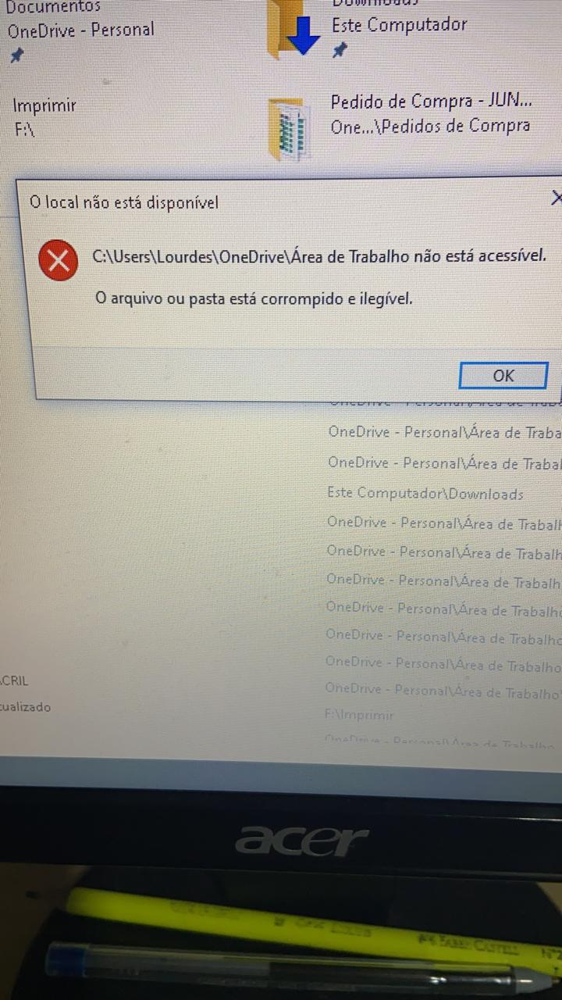
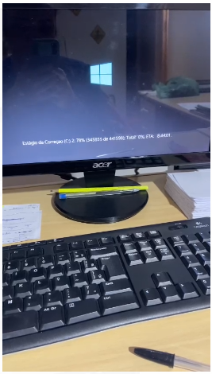

# Pasta Corrompida e ilegivel:

Detectamos esse problema o computador não carregada os arquivos e pastas e icones da 'Area de Trabalho'.
Algumas momentos conseguimos acessar outras pastas por se permissão de criar arquivos e pastas em outras areas do disco (hd).

    

  
#Resolução:

Foi necessário executar o seguinte comando via cmd:

chkdsk /r /f

    

Após reparação estruturas de pastas e arquivos do disco (hd) o computador voltar a permitir o acessos as pastas e arquivos sem problemas.

